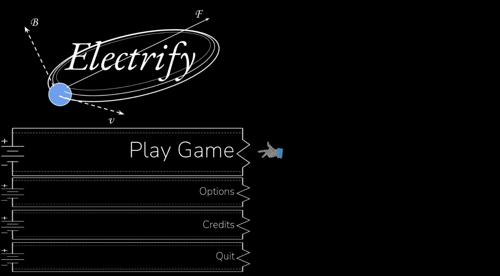

# Electrify
A 2D physics game about controlling a particle around a map using various electromagnetism principle. 

## Introduction
During our class on electromagnetism, we was fascinated about the interaction between various concepts such as charges, conduction, etc. Finding a solution for a question related to electromagnetism concepts is like solving a puzzle with a handful of tool like the Right Hand Rule and Right Curl Rule. In addition, we are fascinated by the prospect of physics puzzle games, inspired by playing the game Brain Dots™. Thus, we come up with an idea of creating an electromagnetism simulation puzzle game to share with the class and reinforce our learning. 

## Objective
The game, developed in Unity, will features a variety of puzzle related to concepts in electromagnetism, including but not limited to: repulsion and attraction, rotating electric rod, conduction and insulation, circular motion on uniform magnetic field. 

## Status
1. Realistic calculation of magnatic field and electric field of sphere, plane, and uniform
2. Realistic approximation of magnetic field and electric field of rod (claculated by splitting rod into point-like segments)
3. Objects which can block electric field and magnetic field
4. Various UI elements to enhance the user experience
5. Handcrafted iconography and UI elements
6. 15 levels testing various concepts of repulsion/attraction, conduction/insulation, magnetic/electric field, etc.

## Credits
Lead Programmer - Tan Vo, [Daniel Nguyen](https://github.com/CrazEpic)
Artists/UI Designer - Tan Vo
Physics Programmer - Tan Vo, [Daniel Nguyen](https://github.com/CrazEpic)

## Media

  
  
  
  

## External Resources
Calculation of electric field for various objects in Desmos:

[Electric Field for Rod 2D Math](https://www.desmos.com/calculator/z7cuslu85f)

[Electric Field for Rod 2D Visualization](https://www.desmos.com/calculator/0o0p7gtvym)

[Electric Field for Prism 3D with Axis](https://www.desmos.com/calculator/jbxpblkmoe)

[Electric Field for Plane 3D with Axis](https://www.desmos.com/calculator/b6fdea1oy9)

[Electric Field for Line 3D with Axis](https://www.desmos.com/calculator/3la2qrkwsg)

[Electric Field for Ring 2D with Axis](https://www.desmos.com/calculator/54kita1rry)

[Electric Field for Point 3D](https://www.desmos.com/calculator/yuuclplnuf)

[Electric Field for Disk 3D](https://www.desmos.com/calculator/93b5mn7vsy)
